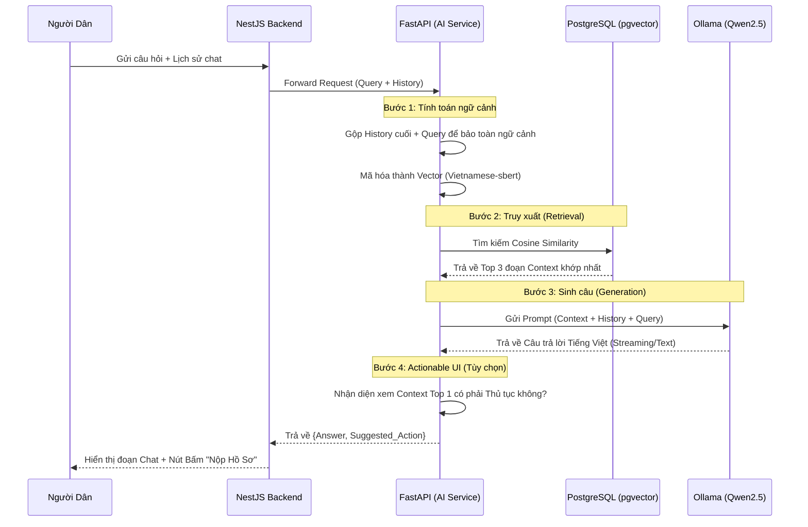

# Báo cáo Kiến trúc Hệ thống: Tự Lạn Smart (Zalo Mini App)

## 1. Tổng quan Dự án (Project Overview)
**Tự Lạn Smart** là một ứng dụng (định hướng tích hợp Zalo Mini App) nhằm hỗ trợ người dân cấp xã/phường thực hiện các dịch vụ công trực tuyến một cách dễ dàng. Điểm nhấn của dự án là việc tích hợp **Trợ lý AI (AI Chatbot)** có khả năng hiểu tiếng Việt, nắm bắt các quy định hành chính địa phương và hướng dẫn người dân làm thủ tục 24/7.

## 2. Kiến trúc Hệ thống (System Architecture)
Hệ thống được thiết kế theo kiến trúc Microservices/Modular (chia nhỏ dịch vụ) để đảm bảo tính mở rộng, hiệu năng cao và dễ bảo trì. Bao gồm 4 thành phần (Component) cốt lõi:

### 2.1. Frontend (Client-side)
Đóng vai trò là điểm tiếp xúc trực tiếp với người dân.
- **Công nghệ:** ReactJS, Vite, Tailwind CSS, Lucide-react.
- **Vai trò:** Cung cấp giao diện hiện đại, quản lý lịch sử chat và hiển thị Actionable UI (các nút thao tác nhanh do AI đề xuất).

### 2.2. Core Backend (NestJS Server)
Đóng vai trò là API Gateway và quản lý logic nghiệp vụ chính.
- **Công nghệ:** NestJS (Node.js), TypeScript.
- **Vai trò:** Quản lý nghiệp vụ (Thủ tục, Lịch hẹn, Tin tức), đồng bộ dữ liệu sang AI Service (Data Sync Pipeline), chuyển tiếp tin nhắn của người dùng.

### 2.3. AI Service (Python NLP Engine)
Đóng vai trò là "Trợ lý thông minh", sử dụng kỹ thuật RAG (Retrieval-Augmented Generation).
- **Công nghệ:** FastAPI (Python), Ollama (Qwen2.5), SentenceTransformers.
- **Vai trò:** Xử lý ngôn ngữ tự nhiên, tính toán vector, tìm kiếm ngữ nghĩa và sinh câu trả lời.

### 2.4. Database & Vector Store
Lưu trữ toàn bộ dữ liệu cấu trúc và phi cấu trúc của hệ thống.
- **Công nghệ:** PostgreSQL, Extension `pgvector`, Prisma ORM.

---

## 3. Chuyên sâu về Cơ chế Trí tuệ Nhân tạo (Deep Dive into AI - RAG System)

Để AI có thể tư vấn chính xác các thủ tục của địa phương mà không bị "ảo giác" (hallucination), hệ thống áp dụng kỹ thuật **RAG (Retrieval-Augmented Generation)**. Quy trình này chia làm 2 pha chính: **Pha Nhập liệu (Ingestion)** và **Pha Sinh câu trả lời (Generation)**.

### 3.1. Pha Nhập liệu & Nhúng Vector (Data Ingestion & Embedding)

Khi cán bộ xã thêm một Thủ tục hành chính mới vào hệ thống (ví dụ qua Prisma Studio), dữ liệu không tự nhiên lọt vào đầu AI. Hệ thống xử lý qua các bước:

1. **Extraction (Trích xuất):** NestJS gom các trường văn bản (Tên thủ tục, Mô tả, Quy trình, Lệ phí) lại thành một văn bản thô.
2. **Chunking (Chia nhỏ):** Văn bản được chia thành các đoạn nhỏ (chunks). Ở dự án này, vì mỗi thủ tục/tin tức không quá dài, chúng ta gộp thành một khối ngữ cảnh (context chunk) nguyên vẹn để giữ nguyên ý nghĩa logic.
3. **Embedding (Biến đổi thành Vector):** FastAPI sử dụng mô hình `keepitreal/vietnamese-sbert` (được huấn luyện riêng cho ngữ nghĩa tiếng Việt) để biến đổi chuỗi văn bản thành một danh sách các số thực (Vector 768 chiều).
4. **Vector Storage (Lưu trữ):** Vector này được lưu thẳng vào PostgreSQL thông qua cột `Unsupported("vector")` của `pgvector`. Bảng `KnowledgeVector` lưu song song cả đoạn text thô (chunk) và vector của nó.

### 3.2. Pha Sinh câu trả lời (Retrieval & Generation Flow)

Khi người dân đặt câu hỏi, quy trình sau sẽ diễn ra trong tíc tắc (dưới 3 giây):

### 3.3. Tối ưu hóa đặc biệt trong hệ thống (Key Optimizations)

Để hệ thống hoạt động xuất sắc, chúng ta đã áp dụng các kỹ thuật sau:
- **Ngữ cảnh theo lịch sử (History-Aware Retrieval):** Thay vì chỉ dùng mỗi câu hỏi cuối cùng của user (ví dụ: *"Thế còn lệ phí thì sao?"* - rất tối nghĩa) để tìm kiếm Vector, hệ thống tự động nối câu trước đó của User vào (ví dụ: *"Đăng ký kết hôn" + "Thế còn lệ phí thì sao?"*) để truy vấn DB. Điều này giúp Vector Search tìm chính xác tài liệu về lệ phí kết hôn.
- **Actionable UI Deduction:** Bằng cách lưu `source_type` (Loại dữ liệu) vào bảng Vector, khi AI trả về kết quả lấy từ một thủ tục, hệ thống backend biết ngay `source_id` của thủ tục đó và đính kèm lệnh `suggested_action`. Frontend nhận được sẽ tự động vẽ ra nút **"👉 Xem chi tiết & Nộp hồ sơ"** ngay dưới tin nhắn của AI.
- **Bảo mật và Tiết kiệm chi phí:** Thay vì dùng API của OpenAI (ChatGPT) vừa tốn tiền vừa có rủi ro lộ dữ liệu công dân, hệ thống chạy mô hình ngôn ngữ lớn (LLM) **Qwen2.5** hoàn toàn nội bộ (Local) qua Ollama.

---

## 4. Lý do lựa chọn công nghệ chung

1. **NestJS thay vì Express thuần:** Cung cấp cấu trúc Dependency Injection chặt chẽ, dễ scale khi logic nghiệp vụ phức tạp.
2. **FastAPI cho AI:** Môi trường Python có sẵn vô số thư viện AI/ML. FastAPI xử lý bất đồng bộ cực tốt.
3. **PostgreSQL + pgvector:** Giúp tối ưu chi phí hạ tầng. Không cần thuê thêm Vector Database đắt đỏ (như Pinecone, Milvus), đồng thời dễ dàng JOIN dữ liệu vector với dữ liệu nghiệp vụ (SQL Relational).
