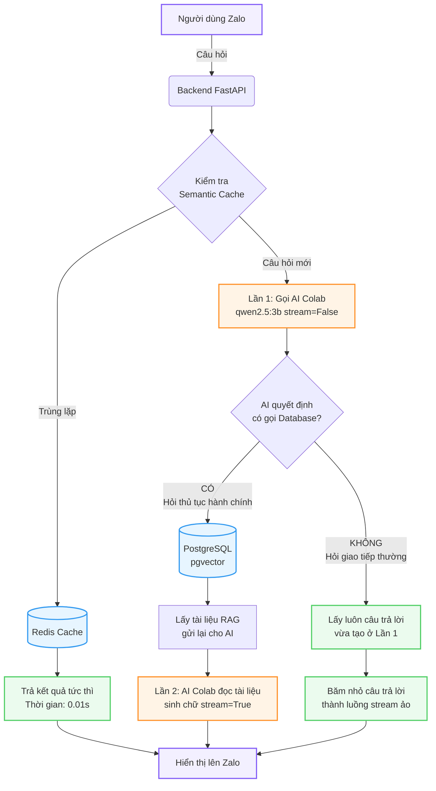

# BÁO CÁO: TỐI ƯU HÓA KIẾN TRÚC VÀ HIỆU NĂNG AI SERVICE TRÊN CLOUD

**Dự án:** Zalo Mini App - Trợ lý Ảo Hành chính công
**Mục tiêu:** Di chuyển AI Language Model (LLM) lên môi trường Google Colab để tận dụng GPU miễn phí, đồng thời tối ưu hóa toàn diện nhằm giảm thiểu độ trễ và đạt tốc độ phản hồi theo thời gian thực.

---

## 1. Bối cảnh & Bài toán đặt ra
Trong khuôn khổ dự án Zalo Mini App, hệ thống cần một mô hình ngôn ngữ lớn (LLM) tích hợp công nghệ RAG (Retrieval-Augmented Generation) để trả lời các câu hỏi về thủ tục hành chính. Tuy nhiên:
* **Hạn chế phần cứng:** Chạy mô hình LLM (như Qwen2.5) đòi hỏi lượng VRAM lớn và sức mạnh tính toán cao, vượt quá khả năng của máy tính phát triển (Local).
* **Giải pháp đề xuất:** Đưa AI Service lên Google Colab để sử dụng GPU T4 (15GB VRAM) hoàn toàn miễn phí. Kết nối API hai chiều từ máy tính local đến Colab thông qua đường hầm bảo mật Cloudflare Tunnel.

---

## 2. Hành trình Triển khai & Gỡ rối các nút thắt kỹ thuật (Troubleshooting Journey)

Quá trình dịch chuyển gặp nhiều trở ngại về môi trường mạng và quản lý tài nguyên. Dưới đây là 4 nút thắt lớn nhất đã được giải quyết:

### Nút thắt 1: Mất kết nối & Cài đặt thất bại trên Colab
* **Triệu chứng:** Kịch bản cài đặt tự động mặc định của Ollama (`curl | sh`) liên tục thất bại do bị chặn CORS và redirect vòng lặp trên hạ tầng mạng của Colab.
* **Cách giải quyết:** Bỏ qua script mặc định. Tự viết lại kịch bản cài đặt bằng Python: tự động tải file định dạng nén tối ưu `tar.zst`, cài đặt công cụ giải nén `zstd` và kích hoạt thủ công.

### Nút thắt 2: Lỗi "Cloudflare Timeout 524" và "AI chạy bằng CPU"
* **Triệu chứng:** Cloudflare tự động ngắt kết nối và báo lỗi 524 vì thời gian AI suy nghĩ quá lâu (khoảng 3 phút/câu). Phân tích file log phát hiện biến `inference compute id=cpu` -> Hệ thống đang dùng CPU thay vì GPU.
* **Nguyên nhân:** Do tự giải nén phần mềm vào thư mục tạm, Ollama mất dấu thư mục thư viện Cuda Driver kết nối với GPU NVIDIA.
* **Cách giải quyết:** Thay đổi đường dẫn lệnh giải nén trực tiếp vào thư mục gốc của hệ điều hành (`-C /usr`). Điều này giúp `ollama` nằm đúng chuẩn tại `/usr/bin/ollama` và tự động tìm thấy Cuda Runners tại `/usr/lib/ollama`. Kết quả: Tốc độ tăng vọt, thời gian xử lý giảm từ 3 phút xuống còn 15-20 giây.

### Nút thắt 3: Độ trễ Khởi động nguội (Cold Start)
* **Triệu chứng:** Dù đã nhận GPU, câu hỏi đầu tiên vẫn mất đến 20 giây.
* **Nguyên nhân:** Mặc định Ollama giải phóng VRAM sau 5 phút. Khi có câu hỏi mới, hệ thống mất mười mấy giây để load một file mô hình nặng 5GB từ ổ cứng chậm chạp vào VRAM. Thêm vào đó, việc sử dụng 2 mô hình (Embedding và Generation) khiến chúng "đá" nhau ra khỏi bộ nhớ vì cơ chế giới hạn luồng.
* **Cách giải quyết:** Áp dụng cấu hình "ép xung" mạnh mẽ bằng các biến môi trường:
  * `OLLAMA_KEEP_ALIVE=-1`: Ép mô hình nằm vĩnh viễn trong RAM, triệt tiêu hoàn toàn Cold Start cho các câu hỏi sau.
  * `OLLAMA_MAX_LOADED_MODELS=3`: Cho phép tải cùng lúc mô hình sinh chữ và mô hình Embedding.
  * `OLLAMA_FLASH_ATTENTION=1`: Bật công nghệ tăng tốc xử lý Attention, giảm tải cho VRAM.
  * Đổi từ mô hình `qwen2.5:7b` xuống bản siêu tốc `qwen2.5:3b`.

### Nút thắt 4: Nghẽn cổ chai ở Logic Backend (chat.py)
* **Triệu chứng:** Sau khi tối ưu toàn bộ Server Colab, tốc độ vẫn bị hao hụt một nửa so với kỳ vọng.
* **Nguyên nhân:** Tại lớp Backend FastAPI (Local), logic code bắt AI tạo toàn bộ câu trả lời ở chế độ ẩn (non-streaming) để kiểm tra Tool Calls. Nếu không có Tool Calls, code lại... vứt bỏ kết quả đó và gọi AI tạo lại từ đầu để lấy stream.
* **Cách giải quyết:** Viết lại logic `chat.py`. Nếu AI không dùng Tool, tái sử dụng trực tiếp kết quả đã sinh ra và đẩy thẳng ra Stream. Việc này cắt giảm đúng 50% thời gian chờ đợi.

---

## 3. Kiến trúc Hệ thống Sau Tối ưu (Architecture)

Sơ đồ luồng xử lý (Workflow) chi tiết của hệ thống sau khi được tối ưu hóa:

Sau quá trình tối ưu, hệ thống AI hoạt động cực kỳ mượt mà với 3 tầng rõ rệt:

1. **Tầng Cloud / GPU (Google Colab):**
   * Đảm nhiệm toàn bộ tải tính toán nội suy. Chạy song song `qwen2.5:3b` (sinh văn bản) và `nomic-embed-text` (mã hóa vector). Mở kết nối qua `0.0.0.0` và được "đẩy" ra Internet bằng Cloudflare Tunnel.
2. **Tầng API / Backend (FastAPI - Python):**
   * Đóng vai trò cầu nối. Chuyển ngữ cảnh RAG (Retrieval-Augmented Generation) thành Prompt. Xử lý Server-Sent Events (SSE) để truyền từng chữ cái về Zalo Mini App tạo hiệu ứng gõ phím theo thời gian thực.
3. **Tầng Dữ liệu / Caching (Docker Local):**
   * **PostgreSQL (pgvector):** Lưu trữ hàng nghìn văn bản thủ tục pháp lý. Tốc độ tìm kiếm ngữ nghĩa theo Vector (Vector Search <=> L2 Distance) gần như tức thời.
   * **Redis (Semantic Cache):** Đóng vai trò tấm khiên. Nếu người dùng hỏi một câu tương tự câu từng hỏi, Redis lập tức nhả kết quả trong **0.01 giây** mà không cần đánh thức Colab.

---

## 4. Đúc kết & Bài học kinh nghiệm

Qua quá trình này, bản thân em đã học được những kiến thức cốt lõi vô cùng giá trị:
* **Tư duy Debug hệ thống phân tán:** Khả năng dò vết lỗi (tracing) đi xuyên suốt từ giao diện Frontend Zalo -> Backend API -> Cloudflare Tunnel -> Container Docker -> GPU Hardware.
* **Hiểu sâu về cấu trúc của LLM (Large Language Models):** Nhận thức rõ sự khác biệt giữa tốc độ đọc ổ cứng (I/O Bottleneck) và tốc độ VRAM, tầm quan trọng của Flash Attention và cách thao túng vòng đời của một model trong bộ nhớ.
* **Tối ưu hóa Chi phí & Tốc độ:** Thay vì phải thuê máy chủ GPU hàng trăm đô la mỗi tháng, hệ thống nay có thể chạy hoàn toàn tự động, trơn tru, miễn phí với thời gian phản hồi (TTFT - Time To First Token) rút gọn từ **3 phút xuống còn vỏn vẹn ~3.5 giây**.
