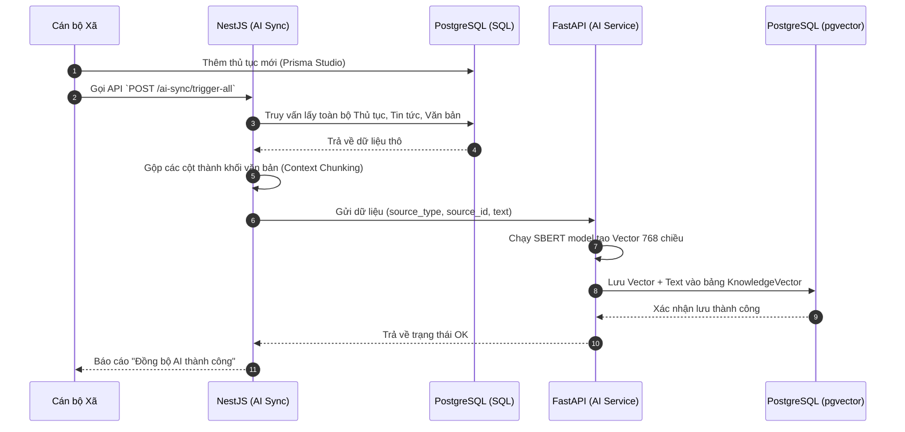
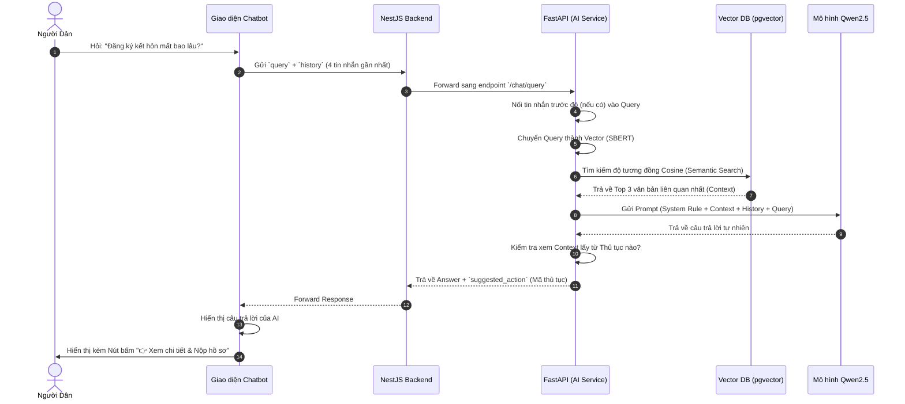

# Sơ đồ Luồng hoạt động (Workflow) & Kiến trúc Hệ thống

Dưới đây là các bản vẽ chi tiết về cách hệ thống Tự Lạn Smart hoạt động. Bạn có thể cài đặt Extension **"Mermaid Preview"** trên VS Code để xem hình ảnh trực tiếp, hoặc copy đoạn code này dán vào trang web [Mermaid Live Editor](https://mermaid.live).

## 1. Sơ đồ Phân rã Component (Backend Breakdown - 15 Features)
Mô tả cách 15 chức năng chính được tổ chức vào 5 cụm dịch vụ lõi:

```mermaid
graph TD
    %% Khối Nguời dùng
    Citizen(("Người dân"))
    Admin(("Cán bộ xã"))

    %% Khối Frontend
    subgraph Frontend [Zalo Mini App / Web ReactJS]
        UI["Giao diện Dịch vụ công & Chatbot"]
        AdminUI["Giao diện Web Admin"]
    end

    %% Khối 1: Public Information Service
    subgraph InfoService [1. Public Information Service]
        News["(1) Tin tức điều hành"]
        Planning["(7) Thông tin quy hoạch"]
        Invest["(8) Dự án đầu tư"]
        Bidding["(9) Thông tin đấu thầu"]
        Schedule["(11) Lịch công tác"]
    end

    %% Khối 2: Administrative Service
    subgraph AdminService [2. Administrative Service]
        Proc["(3) Danh mục thủ tục hành chính"]
        Forms["(5) Kho mẫu đơn, tờ khai"]
        Docs["(15) Kho văn bản điện tử"]
    end

    %% Khối 3: Interaction & Booking Service
    subgraph InteractService [3. Interaction & Booking Service]
        Booking["(4) Đặt lịch làm việc trực tuyến"]
        Feedback["(10) Tiếp nhận phản ánh"]
        Survey["(12) Khảo sát sự hài lòng"]
    end

    %% Khối 4: AI & Smart Service
    subgraph AIService [4. AI & Smart Service (FastAPI)]
        Chatbot["(2) Chatbot AI Dịch vụ công"]
        DataSync["AI Data Sync Module"]
    end

    %% Khối 5: Utility & External Service
    subgraph UtilService [5. Utility & External Service]
        DVC["(6) Cổng Dịch vụ công Quốc gia (Link)"]
        Hotline["(13) Đường dây nóng"]
        Map["(14) Bản đồ và định vị"]
    end

    %% Core API
    API{"API Gateway (NestJS)"}
    
    %% DB
    DB[("PostgreSQL Database & pgvector")]

    %% Connections
    Citizen --> UI
    Admin --> AdminUI
    
    UI <--> API
    AdminUI <--> API
    
    API <--> InfoService
    API <--> AdminService
    API <--> InteractService
    API <--> AIService
    API <--> UtilService
    
    InfoService & AdminService & InteractService & AIService <--> DB
```

---

## 2. Luồng Đồng bộ Dữ liệu cho AI (Data Ingestion Workflow)
Mô tả cách AI học các thủ tục hành chính mới khi cán bộ thêm vào Database:



---

## 3. Luồng Hỏi - Đáp của Chatbot AI (RAG Workflow)
Mô tả cách AI đọc ngữ cảnh và trả lời người dân:


